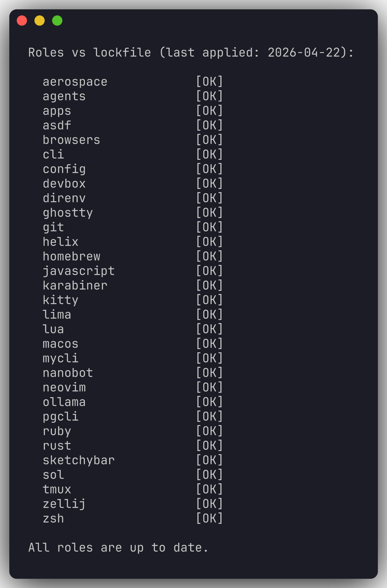
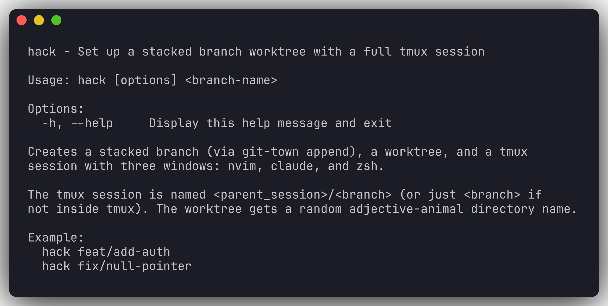
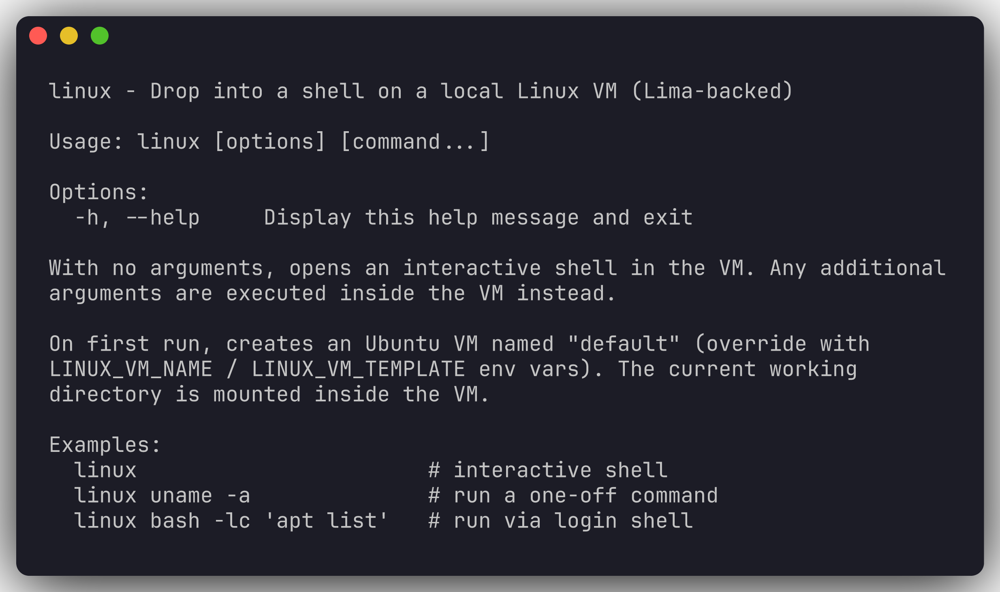

# macOS System Setup

Ansible playbook that provisions a fresh macOS machine into my working environment: window manager, terminals, editors, language toolchains, and a handful of custom scripts.


## Regenerating docs images

CLI frames in `docs/cli/` are generated headlessly via [freeze](https://github.com/charmbracelet/freeze):

```sh
brew install charmbracelet/tap/freeze
bin/screenshots cli         # regenerate CLI frames only
bin/screenshots desktop     # requires a logged-in GUI session
bin/screenshots             # both
```

## Install

Clone into `~/system` (the path is assumed by `bin/bootstrap` and some roles):

```sh
git clone git@github.com:HoganMcDonald/system_settings.git ~/system
cd ~/system
bin/bootstrap
```

On first run, `bin/bootstrap`:

1. Installs Homebrew (if missing) and Ansible.
2. Prompts you to populate `~/.vault_pass.txt` with the Ansible vault password.
3. Runs the full playbook against `localhost`.

## Usage

Run everything:

```sh
bin/bootstrap
```

Run a single role by tag:

```sh
bin/bootstrap neovim
bin/bootstrap lima
```

Roles are tagged one-to-one with their role name — see `dotfiles.yml` for the full list.

## What's in the box

**Tools**
`homebrew`, `git`, `asdf`, `devbox`, `direnv`, `lima`, `ollama`, `cli`, `zsh`, `tmux`, `pgcli`, `mycli`, `agents`, `nanobot`, `neovim`, `helix`, `zellij`

**Apps** (Homebrew casks)
`apps` (Linear, Figma, Brain.fm), `aerospace`, `browsers`, `kitty`, `ghostty`, `sol`

**Languages**
`lua`, `ruby`, `rust`, `javascript`

**Desktop & System**
`sketchybar` (modular Lua status bar), `karabiner`, `macos` (system preferences)

## Notable roles

### `lima` — Linux VM with host passthrough

The `linux` CLI (shipped by the `zsh` role) drops you into an Ubuntu VM backed by Lima. On first invocation it creates the VM with a writable home mount; every invocation installs an `xdg-open` shim inside the guest that forwards `open` calls back to the host via a queue file. A launchd agent on the host (`com.hoganmcdonald.lima-open`) tails the queue and runs `open(1)` on each URL.

```sh
linux                 # interactive shell
linux uname -a        # one-off command
# inside the VM:
xdg-open https://example.com  # opens in your host browser
```

### `sketchybar` — Lua status bar

Modular configuration built on SbarLua. Components live in `roles/sketchybar/files/bar/components/` and use a fluent-API wrapper (`Bar`, `Item`, `Bracket`, `Event`, `Animation`) in `roles/sketchybar/files/lib/`.

### `agents` — Claude Code & co.

Installs global config, rules, skills, and subagents for Claude Code, plus related agent tooling.

## Workflows

### `dotfiles` — keep the repo and machine in sync

`bin/dotfiles` is a thin wrapper around git + Ansible that tracks which roles have been applied. State lives in `~/.dotfiles/lock.json` (per-role git hash of the last successful apply, plus a timestamp).

```sh
dotfiles status     # which roles have drifted since last apply
dotfiles apply      # pull, run ansible only for changed roles, update lockfile
dotfiles apply git  # force-apply a single role by tag
dotfiles sync       # git pull + git push (no ansible)
dotfiles lock       # manually snapshot current role hashes
```

Typical loop: edit a role, commit, `dotfiles sync` to push, then on any machine `dotfiles apply` to pull and run only what actually changed.



### `hack` / `rehack` / `unhack` / `hacks` — stacked worktree sessions

Built around git-town stacked branches, git worktrees, and tmux. Worktrees live under `<repo>/.worktrees/<adjective-animal>/`.

```sh
hack feat/add-auth     # git-town append → worktree → tmux session (nvim/claude/zsh)
hacks                  # list active hack worktrees and their session state
rehack                 # recreate tmux sessions for orphaned worktrees (post-reboot)
unhack feat/add-auth   # tear down session + worktree, delegate branch cleanup to `git merged`
```

The tmux session is named `<parent>/<branch>` so stacks nest cleanly inside an outer session.



### `swap` / `unswap` — run a branch in the main checkout

Some apps can't run from two working directories at once (ports, singletons, local databases). `swap` temporarily moves a feature branch out of its worktree and into the main checkout; `unswap` reverses it.

```sh
swap feat/add-auth    # main checkout → feature branch; worktree detached
unswap                # restore main branch to main dir, reattach worktree
unswap --force        # skip branch verification
```

Uncommitted changes flow in both directions, so it's safe to keep editing during a swap.

### `review` / `unreview` — dedicated review worktrees

For reviewing someone else's branch without disturbing your own stack. Checks out the branch in a linked worktree and opens a tmux session with Claude running the `/review` skill.

```sh
review feat/their-branch   # worktree + tmux session at review/<branch>
unreview feat/their-branch # tear down session + worktree (never deletes the branch)
```

### `linux` — Lima-backed Linux VM with host passthrough

Drop into an Ubuntu VM that shares your home directory. First run creates the VM with a writable home mount; every run installs an `xdg-open` shim in the guest that forwards browser/URL opens to the host via a queue file watched by a launchd agent.

```sh
linux                          # interactive shell
linux uname -a                 # one-off command
# inside the VM:
xdg-open https://example.com   # opens in your host browser
```

Env vars: `LINUX_VM_NAME` (default `default`), `LINUX_VM_TEMPLATE` (default `template://ubuntu`).



### `myconnect` / `pgconnect` — named database connections

Stash a connection URL under a short alias, then connect by name.

```sh
pgconnect "postgres://user:pw@host:5432/db" dev
pgcli "service=dev"

myconnect "mysql://user:pw@host:3306/db" dev
mycli -d dev
```

`pgconnect` writes `~/.pgpass` (chmod 600) and `~/.pg_service.conf`. `myconnect` updates `~/.myclirc` with DSN aliases.

## Layout

```
bin/
  bootstrap        # entry point
  lock-role        # records completed roles
dotfiles.yml       # main playbook
hosts              # ansible inventory (localhost)
roles/<name>/
  tasks/main.yml   # what the role does
  files/           # static assets
  templates/       # jinja2-rendered configs
  defaults/main.yml
  meta/main.yml    # role dependencies
vault/             # encrypted variables (needs ~/.vault_pass.txt)
```

## Requirements

- macOS (Apple Silicon or Intel)
- Sudo access (prompted via `--ask-become-pass` where needed)
- `~/.vault_pass.txt` for the Ansible vault
- `terminal-notifier` (optional) — used to notify on bootstrap completion
