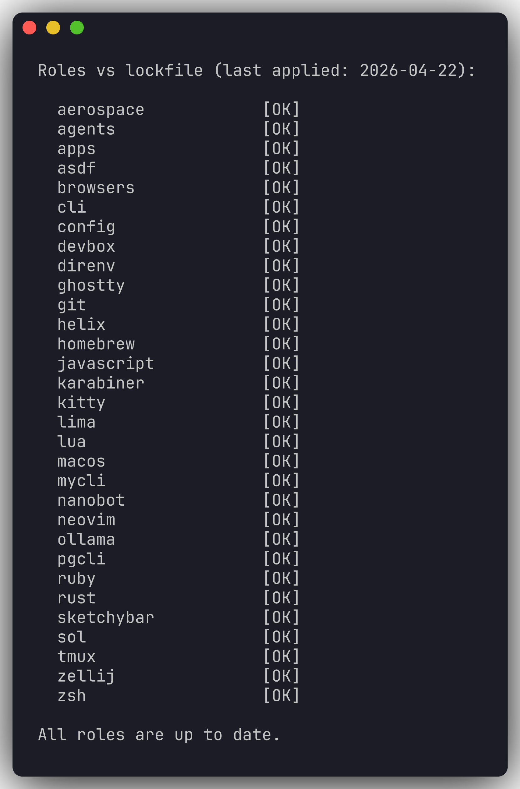
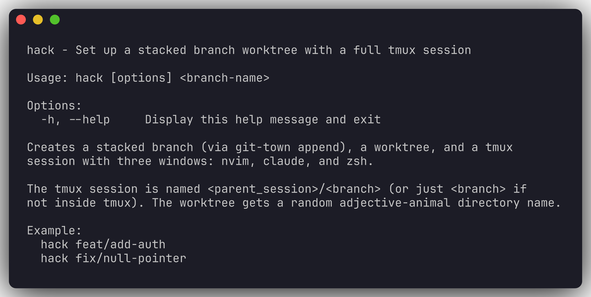
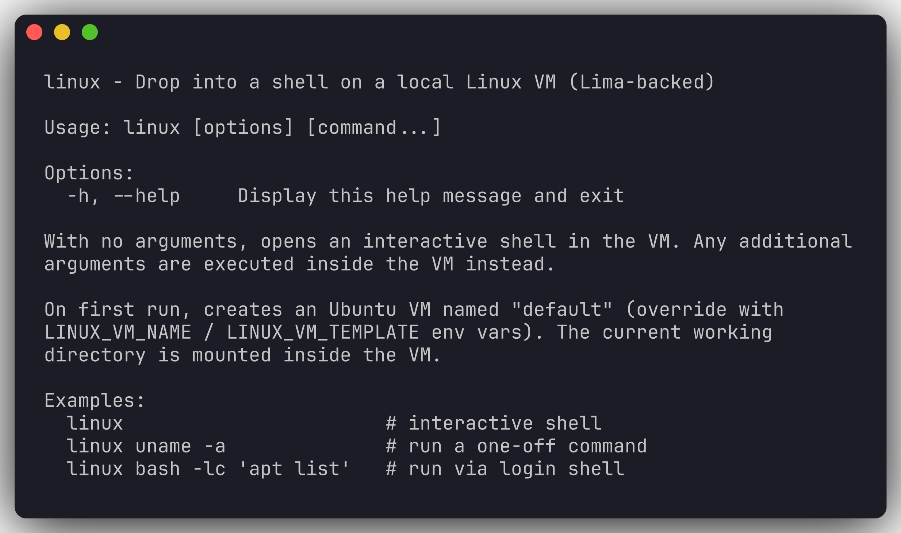

# macOS System Setup

Ansible playbook that provisions a fresh macOS machine into my working environment: window manager, terminals, editors, language toolchains, and a handful of custom scripts.


## Regenerating docs images

CLI frames in `docs/cli/` are generated headlessly via [freeze](https://github.com/charmbracelet/freeze):

```sh
brew install charmbracelet/tap/freeze
bin/screenshots cli         # regenerate CLI frames only
bin/screenshots desktop     # requires a logged-in GUI session
bin/screenshots             # both
```

## Install

Clone into `~/system` (the path is assumed by `bin/bootstrap` and some roles):

```sh
git clone git@github.com:HoganMcDonald/system_settings.git ~/system
cd ~/system
bin/bootstrap
```

On first run, `bin/bootstrap`:

1. Installs Homebrew (if missing) and Ansible.
2. Prompts you to populate `~/.vault_pass.txt` with the Ansible vault password.
3. Runs the full playbook against `localhost`.

## Usage

Run everything:

```sh
bin/bootstrap
```

Run a single role by tag:

```sh
bin/bootstrap neovim
bin/bootstrap lima
```

Roles are tagged one-to-one with their role name — see `dotfiles.yml` for the full list.

## What's in the box

**Tools**
`homebrew`, `git`, `asdf`, `devbox`, `direnv`, `lima`, `cli`, `zsh`, `tmux`, `pgcli`, `mycli`, `agents`, `dashboard`, `github_gtd`, `nanobot`, `neovim`, `helix`, `zellij`

**Apps** (Homebrew casks)
`apps` (Linear, Figma, Brain.fm), `aerospace`, `browsers`, `kitty`, `ghostty`

**Languages**
`lua`, `ruby`, `rust`, `javascript`

**Desktop & System**
`sketchybar` (modular Lua status bar), `karabiner`, `macos` (system preferences)

## Notable roles

### `lima` — Linux VM with host passthrough

The `linux` CLI (shipped by the `zsh` role) drops you into an Ubuntu VM backed by Lima. On first invocation it creates the VM with a writable home mount; every invocation installs an `xdg-open` shim inside the guest that forwards `open` calls back to the host via a queue file. A launchd agent on the host (`com.hoganmcdonald.lima-open`) tails the queue and runs `open(1)` on each URL.

```sh
linux                 # interactive shell
linux uname -a        # one-off command
# inside the VM:
xdg-open https://example.com  # opens in your host browser
```

### `sketchybar` — Lua status bar

Modular configuration built on SbarLua. Components live in `roles/sketchybar/files/bar/components/` and use a fluent-API wrapper (`Bar`, `Item`, `Bracket`, `Event`, `Animation`) in `roles/sketchybar/files/lib/`.

### `agents` — Claude Code & co.

Installs global config, rules, skills, and subagents for Claude Code, plus related agent tooling.

## Workflows

### `dotfiles` — keep the repo and machine in sync

`bin/dotfiles` is a thin wrapper around git + Ansible that tracks which roles have been applied. State lives in `~/.dotfiles/lock.json` (per-role git hash of the last successful apply, plus a timestamp).

```sh
dotfiles status     # which roles have drifted since last apply
dotfiles apply      # pull, run ansible only for changed roles, update lockfile
dotfiles apply git  # force-apply a single role by tag
dotfiles sync       # git pull + git push (no ansible)
dotfiles lock       # manually snapshot current role hashes
```

Typical loop: edit a role, commit, `dotfiles sync` to push, then on any machine `dotfiles apply` to pull and run only what actually changed.



### `hack` / `rehack` / `unhack` / `hacks` — stacked worktree sessions

Built around git-town stacked branches, git worktrees, and tmux. Worktrees live under `<repo>/.worktrees/<adjective-animal>/`.

```sh
hack feat/add-auth     # git-town append → worktree → tmux session (nvim/opencode/zsh)
hacks                  # list active hack worktrees and their session state
rehack                 # recreate tmux sessions for orphaned worktrees (post-reboot)
unhack feat/add-auth   # tear down session + worktree, delegate branch cleanup to `git merged`
```

The plan agent renames the tmux session to `<repo>/<type>(<summary>)`, grouping
sessions by source repository in tmux pickers.



### `swap` / `unswap` — run a branch in the main checkout

Some apps can't run from two working directories at once (ports, singletons, local databases). `swap` temporarily moves a feature branch out of its worktree and into the main checkout; `unswap` reverses it.

```sh
swap feat/add-auth    # main checkout → feature branch; worktree detached
unswap                # restore main branch to main dir, reattach worktree
unswap --force        # skip branch verification
```

Uncommitted changes flow in both directions, so it's safe to keep editing during a swap.

### `review` — dedicated review worktrees with an SLA-aware queue

For reviewing someone else's PR without disturbing your own stack. The PR head is checked out **detached** in `.worktrees/reviews/pr-<number>` — no branch is created or moved — and gets a tmux session with two windows: `tuicr` (the review TUI) and `opencode`.

Any ref shape works, all resolved in the current repository:

```sh
review HEAD                                    # next-up PR (see below)
review 1234                                    # PR number
review https://github.com/o/r/pull/1234        # PR URL
review HEX-4821                                # Linear ticket
review https://linear.app/t/issue/HEX-4821/x   # Linear link → newest matching PR
review feat/their-branch                       # branch name
```

"Next up" is the oldest PR whose review is still requested from you and that you haven't submitted a review for. Drafts and snoozed PRs are never auto-selected.

```sh
review log             # queue with author, LOC, age, and SLA
review status          # active review worktrees + tmux/tree health
review snooze 1234     # bottom of the stack until end of day
review unsnooze 1234   # back into the HEAD rotation immediately
review unsnooze --all  # clear every snooze
review clear           # tear down every review worktree + session
review clear 1234      # tear down just one
```

`review log` tracks a 24-hour SLA measured in **Monday–Friday hours only**, counted from when the review was requested (a re-request restarts the clock). A Friday 3pm request is due Monday 3pm. Override with `REVIEW_SLA_HOURS`.

Snoozes expire at local midnight. Snoozed PRs stay visible in `review log`, sorted to the bottom, and can still be opened explicitly — only `review HEAD` skips them. `review unsnooze` ends one early; with no ref it lists what's snoozed rather than guessing.

`review clear` refuses dirty worktrees unless given `--force`, and never deletes branches. `unreview` remains as a deprecated alias.

Tables are box-drawn and colour-coded: SLA is green when comfortable, yellow inside the last 4 hours, red once breached; `review status` colours tmux/worktree health the same way. Colour follows `NO_COLOR` and switches off when piped — override with `REVIEW_COLOR=always|never` and `REVIEW_BORDER=utf8|ascii`.

If the queue looks wrong, `REVIEW_DEBUG=1 review log` prints the resolved repo, your login, and the PR numbers GitHub matched. GitHub API failures are reported rather than being reported as an empty queue.

Everything works under both BSD and GNU `date`/`awk`, so a `nix-shell` that puts GNU coreutils ahead of `/bin` behaves identically.

Tests for the ref parsing and business-hour math:

```sh
roles/zsh/tests/test_review.sh
```

### GitHub GTD — actionable pull requests in Todoist

The `github_gtd` role installs a five-minute LaunchAgent that puts actionable pull-request work in the native Todoist Inbox. Todoist is the task-management source of truth: moving, renaming, prioritizing, scheduling, or completing a generated task is preserved. GitHub supplies action state and the automation-owned context label.

Generated tasks use these labels:

- `@needs-review` for direct and team review requests
- `@fixup` for authored PRs with changes requested, conflicts, or failing CI
- `@needs-merge` for authored PRs that are approved, mergeable, and passing CI
- `@github` for the combined queue

Authored drafts and authored PRs waiting on CI or another reviewer do not create tasks. Requested reviews arrive whenever the PR is not a draft. A completed task is not recreated for the same action. A re-requested review or a later transition back into an actionable state creates a new task.

Review requests are due after 24 hours of Monday-Friday time. The due datetime is set only when the task is created, so manually rescheduling it remains authoritative. A Friday 3pm request is due Monday 3pm.

Get a personal API token from **Todoist Settings → Integrations → Developer**, then install the role:

```sh
bin/bootstrap github_gtd  # installs the CLI and inactive LaunchAgent
github-gtd auth           # stores the token in Keychain and starts synchronization
```

At the Keychain prompt, paste the Todoist personal API token rather than your Mac password or Todoist account password. The command validates the token before starting synchronization and removes it if Todoist rejects it.

The token is read from Keychain at runtime and is never written to this repository or the LaunchAgent plist.

```sh
github-gtd dry-run  # preview reconciliation
github-gtd sync     # synchronize now
github-gtd doctor   # verify GitHub, Todoist, and labels
github-gtd status   # inspect launchd and the last successful sync
github-gtd logs     # follow the service log
```

The synchronizer creates its labels automatically. Recommended Todoist filters:

| Name | Query |
| --- | --- |
| GitHub Actions | `@github & (@needs-review \| @fixup \| @needs-merge)` |
| Reviews | `@needs-review` |
| Fixups | `@fixup` |
| Ready to Merge | `@needs-merge` |
| GitHub Today | `@github & today` |
| Overdue Reviews | `@needs-review & overdue` |
| Unscheduled GitHub | `@github & no date` |

Favorite `GitHub Actions` and `Reviews`. During inbox processing, move generated tasks into normal GTD projects and add labels such as `@computer` or `@deep-work`; the daemon preserves those choices. Manually created tasks may use the same labels because only tasks carrying a `GTD Sync` marker are managed.

Tests:

```sh
python3 -m unittest roles/github_gtd/tests/test_sync.py
```

### `linux` — Lima-backed Linux VM with host passthrough

Drop into an Ubuntu VM that shares your home directory. First run creates the VM with a writable home mount; every run installs an `xdg-open` shim in the guest that forwards browser/URL opens to the host via a queue file watched by a launchd agent.

```sh
linux                          # interactive shell
linux uname -a                 # one-off command
# inside the VM:
xdg-open https://example.com   # opens in your host browser
```

Env vars: `LINUX_VM_NAME` (default `default`), `LINUX_VM_TEMPLATE` (default `template://ubuntu`).



### `myconnect` / `pgconnect` — named database connections

Stash a connection URL under a short alias, then connect by name.

```sh
pgconnect "postgres://user:pw@host:5432/db" dev
pgcli "service=dev"

myconnect "mysql://user:pw@host:3306/db" dev
mycli -d dev
```

`pgconnect` writes `~/.pgpass` (chmod 600) and `~/.pg_service.conf`. `myconnect` updates `~/.myclirc` with DSN aliases.

## Layout

```
bin/
  bootstrap        # entry point
  lock-role        # records completed roles
dotfiles.yml       # main playbook
hosts              # ansible inventory (localhost)
roles/<name>/
  tasks/main.yml   # what the role does
  files/           # static assets
  templates/       # jinja2-rendered configs
  defaults/main.yml
  meta/main.yml    # role dependencies
vault/             # encrypted variables (needs ~/.vault_pass.txt)
```

## Requirements

- macOS (Apple Silicon or Intel)
- Sudo access (prompted via `--ask-become-pass` where needed)
- `~/.vault_pass.txt` for the Ansible vault
- `terminal-notifier` (optional) — used to notify on bootstrap completion
